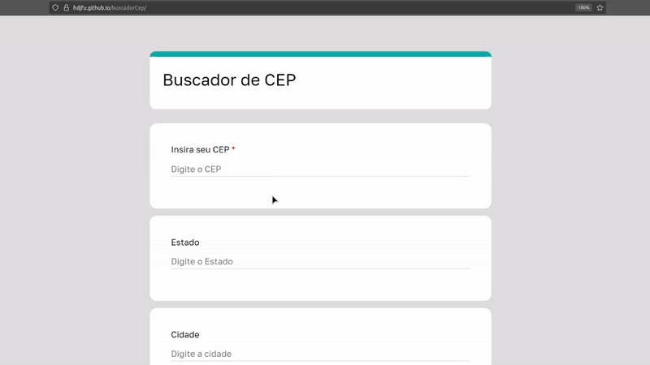

# 📍 Buscador de CEP

  

---

## 🧾 Descrição

Aplicação web responsiva desenvolvida para realizar consultas de endereços a partir de CEPs brasileiros de forma rápida e eficiente.  
Os dados são obtidos em tempo real por meio da integração com uma API externa, proporcionando uma experiência fluida e precisa ao usuário.

Projetada para fácil adaptação em sistemas que exijam preenchimento automatizado de endereços, como plataformas de e-commerce, CRMs e formulários dinâmicos.

---
